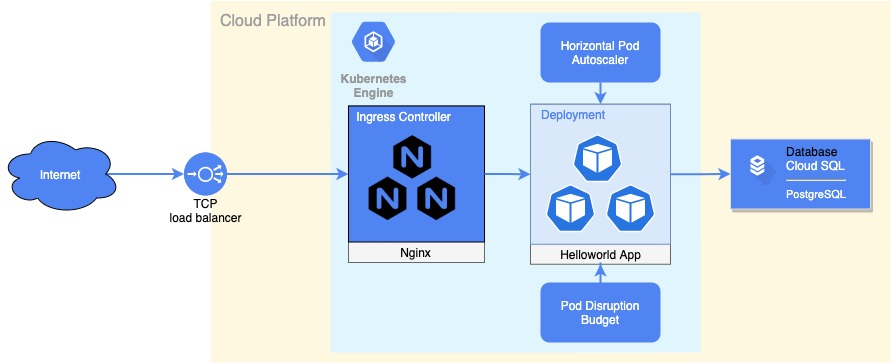

= Helloworld test app

== Check example

[source,bash]
----
curl https://tikhomirov.space/hello/atsikham
----

== Verified environment

K8s cluster: 1.18.15-gke.1501

Database: PostgreSQL 13 (Google Cloud SQL)

== System diagram

== Description

Description: Saves/updates the given user's name and date of birth in the database.
Request: PUT /hello/<username> { "dateOfBirth": "YYYY-MM-DD" }
Response: 204 No Content

Note:
<username> must contain only letters. YYYY-MM-DD must be a date before the today date.
Description: Returns hello birthday message for the given user Request: Get /hello/<username>
Response: 200 OK
Response Examples:
A. If username’s birthday is in N days:
{ “message”: “Hello, <username>! Your birthday is in N day(s)”
}
B. If username’s birthday is today:
{ “message”: “Hello, <username>! Happy birthday!” }
